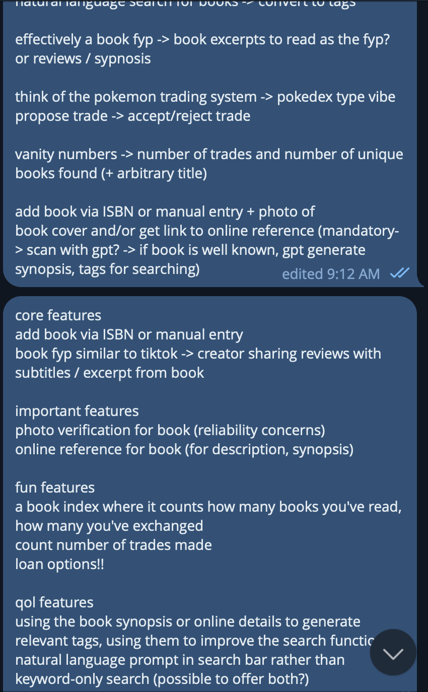

### How to Test
Visit the deployed Vercel frontend.

**Disclaimer**: Many planned features did not come to fruition -- read below for more

### The Good Parts
I managed to implement all basic CRUD functions, for adding books, book reviews, and updating them under different user profiles. On top of that, I added ISBN entry for book details, as the API is easily accessible and provides many key details that reduce friction in data entry.

From a barebones UI/UX perspective, everything that was **necessary** was present in the final prototype. However, there were many features planned out that could not be executed, and I will briefly explain why that is the case below.

### The Entire Trainwreck, Written Out
Unfortunately, it's probably easier to document what went well rather than what went wrong in the past 24 hours, because so many things went wrong. The product you see right now is a shell of the original vision it was supposed to be, due to a few major wrong decisions made along the way.

The ideation process was relatively smooth: I planned out all the features I wanted to do, including some QoL features that I felt were important, followed by a quick categorisation of said features in terms of importance and urgency:



This was followed by me asking around for anyone who still reads physical books (turns out... pretty rare) and taking feedback on what features they would like to see in an application like this. Some key ones mentioned were:
- Specifying the condition that the book was in
- Some form of verification that the person exchanging the book actually has said book

### Planned Features
The core features included:
- Adding a book via ISBN (plan was to use a simple API call to achieve this), with the option for manual entry if needed for key details
- Verification of the book's existence via photo upload, which would be processed by a vision-based LLM (i.e GPT wrapper)
- A "for you" page that would show reviews of a book for users to repost or offer exchanges

Some fun features that I thought would be cool to add included:
- Vanity numbers such as number of trades, number of total books read
- An option to loan books rather than permanently exchange them
- Achievements related to said vanity numbers for user retention

And finally the random/miscellaneous QoL features:
- Comments section for people to argue with the reviewer about the book in question
- LLM to analyse the synopsis of the book and determine the tags associated with the book, which could be used to improve the search function (opposed to searching just by name)
- Natural language prompts in the search bar as opposed to conventional keyword matching

## The Drizzle ORM incident
In theory, the tech stack was simple:
- Vercel frontend
- Drizzle ORM backend (that had Vercel support!)
- OpenAI / Gemini API (if on-browser compute was viable)

By 4pm the Vercel frontend structure was more or less complete, with the outline of key pages, components and desired functions laid out. This meant that it was time to transition to a proper database and introduce CRUD functions. Vercel PostGreSQL offered a direct integration with Drizzle ORM, which I thought would be useful for the project.

Unfortunately, that was not the case.

I was running into mysterious errors of Drizzle not being able to find my connection string (despite me putting it in 2 env files, .env and .env.local, testing every permutation and deleting each file once to be sure), and on top of that, more problems continue to crop up as the documentation proved to be inconsistent between node.js and vercel. My mistake was deciding to dive further into the documentation, hoping that I would figure it out and link the mess of articles together (StackOverflow wasn't really helpful, people were suggesting to rename the .env). This cost me over 5 hours as I tried every fix I could find.

This meant that by 10pm, I had no database and nothing to work with. I decided to revert back to my failsafe of MongoDB, which was much easier to set up (and also nonrelational, which is convenient). The database was then up and running around 11pm, with the CRUD functions effectively complete by 12 midnight.

But the problems didn't end there.

### Clerk & Why It's Probably Better to Hardcode
In a bid to reduce the time spent constructing a proper authentication and log in system (having to worry about security and all that), I opted to used Clerk, which I had some experience with before. This, paired with the easily accessible username meant that I just needed to:
```
useUser()
```

This went well up till the point that I implemented my DB, and realised that every book and every review entry I created was under my own username, and to properly test, I had to log in with a different Github account (which, surprisingly, I don't have). 


### Conclusion
So at this point, at around 4am as I'm writing this, between all the bugs and the incidents, I called it a night. I honestly had many features that I thought would be fun to implement and would significantly improve the user experience, unfortunately I underestimated how much of a beast implementing an unfamiliar database in Drizzle ORM turned out to be -- if I just had stuck with MongoDB, I would probably have had a better application rolled out in way shorter time.

Either way, lesson learnt, and I'm still somewhat satisfied with the final product.
